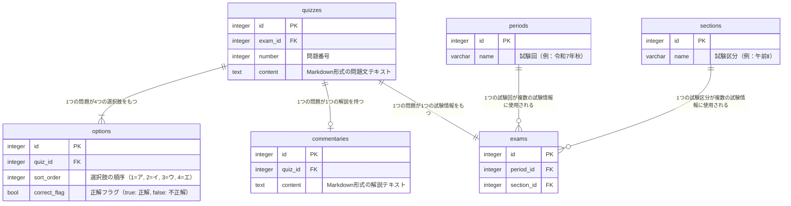

# 概要

`v0.requirements.md`に記載されているスコープのうち、`2. データ作成`を実施する。

## スコープ完了定義

データ設計(ER図や、DB以外でデータを持たせる部分があればその設計)が完了
初期マイグレーション作成済み

## 設計

### 1. DBスペシャリスト試験の形式について

#### 1. 午前I
午前Iは全30問の四問択一形式である。（4つある選択肢のうち1つだけが答えになる形式）
以下各試験回の出題形式についてまとめた。

`令和7年`
- 解答の選択肢が分数である場合がある。
- 問題部に表が含まれる場合がある。
- 問題部にアンゾフの成長マトリクス（図）が含まれる。

問題に表が含まれるのが3問、図が含まれるのが1問、選択肢に分数が含まれるのが1問あった。

`令和6年`
- 問題部に「条件」が含まれる場合がある。（問24）
- 令和7年と同様に問題部に表や図が含まれる（全部で3~4問）

`令和5年`
- 選択肢が表である場合がある（問6）
- 選択肢が図である場合がある（問9）
- 選択肢（ア、イ、ウ、エ）が表のヘッダーである場合がある（問9, 問13）

`他`
- 選択肢がグラフである場合がある

総評：問題部・解答部ともに図や表を含む場合がある（写真1, 2）。表の中に選択肢があるパターンもある(写真3)。

`写真1: 問題部に図を含む場合(R5)`

`写真2: 解答部に表を含む場合`

`写真: 表の中に選択肢がある場合`

#### 2. 午前Ⅱ
午前Ⅰ問題と出題形式に差はない。

#### 3. 午後Ⅰ
記述式問題。解答例を見てどのような解答パターンがあるかをまとめる。

- 穴埋め形式で答えを記号や数値で書くものがある。（例：ア：加盟企業コード）
- 図を書かせる問題がある

`写真: 午後問題の出題形式`

総評：図（ER図みたいなの）を書かせる問題が1,2問。残りは文章を書かせる問題。解答フォーマットを用意するといいかも。図の問題が難しそうなので、最初は省略してもいいかもしれない。

#### 4. 午後Ⅱ
午後Ⅰ問題と出題形式に差はない。

### 2. 問題データの持ち方について

#### 基本的な考え方

問題文 + 条件 + 選択肢を含めて「問題部」として扱う。ユーザーは問題部で選択肢まですべて読み、「ア」「イ」「ウ」「エ」のボタンを押下することで回答できるようにする。すなわち、解答部のボタンに選択肢のテキストは含めず、ただのボタンとする。

上記のようにした理由：
「表の中に選択肢がある場合」のとき、選択ボタンと選択肢のテキストを同居させるのが難しい。また、実際のDBスペシャリスト試験も「選択肢も含めた問題文を読んでマーク用紙にマークする」という形式であることから、選択肢には記号の情報だけ持たせるのが正しいと判断した。

#### データ形式と保存先

問題部（問題文/条件/選択肢）はMarkdown形式でDBに保存する。テキストや数式、表はマークダウンで記載するものとし、図やグラフは別途画像をストレージに保存したものを表示する。

`注意`
この方針はMarkdownテキストをhtmlに変換できることを前提としている。この前提が崩れた場合は再考が必要である。

### 3. ER図

### 4. UI変更

今回のスコープでUIの変更が必要になったので、Figmaを修正する。

変更箇所：
- 選択肢のテキストは問題部に記載し、解答部は解答ボタンだけにする。

## 対応手順(目安)

1. FastAPI, Postgresql環境をDockerで作成（[参考](https://zenn.dev/yutomoritajp/articles/5427ee5163859b)）
2. DBスペシャリスト試験の形式について調査し、データの持たせ方を考える
3. ER図を作成する
4. マイグレーション作成