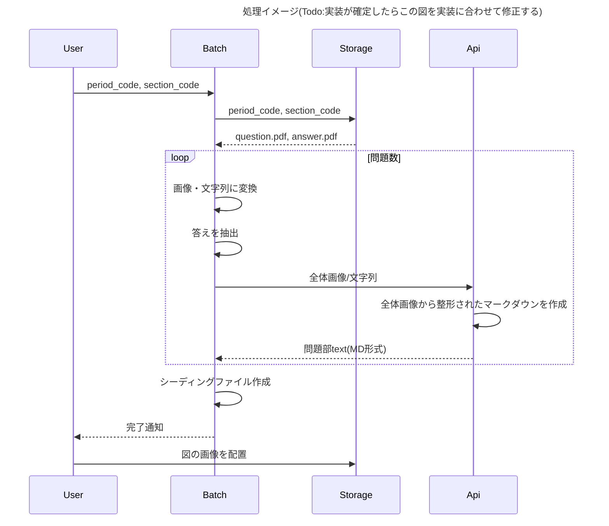

# 概要

`v0.requirements.md`に記載されているスコープのうち、`3. データ作成`を実施する。

## スコープ完了定義

データベーススペシャリスト試験(DB)の令和7年度(秋)の午前Ⅰの過去問の表示に必要なデータをDB及びストレージに入れる。
※ 解説(`commentaries`テーブルの作成)は対象外。

## 設計

### 過去問データの作成方法について

`quizzes`テーブルに格納する`number`, `content`, `correct_option`, `status`はbatch処理 + LLM APIで作成する。
成果物として`exams`テーブルと`quizzes`テーブルにデータが格納されるシーディングファイルが作成される。

#### 大まかな処理の流れと責務

1. 元データとなるpdfファイルをストレージから取得する。（batch処理）
2. pdfから必要な情報（画像・文字列）を切り出し、APIを呼ぶ。(batch処理)
3. 問題部のマークダウン文字列を成形して返す。画像パスはプレースホルダーとする（LLM API）
4. 問題部の画像パスに実パスを埋め込む（batch処理）
5. APIから取得した文字列やpdfから抽出した答えでシーディングファイルを作成する。（batch処理）
6. 画像をストレージの適切な場所に配置する。（User処理）


注意点
- APIに画像と文字列を渡すのは、画像は問題文全体の構造を提示するため。文字列を渡すのは表記ゆれ等が起きにくくするため。すなわち構成は画像を正とし、文言は文字列を正とする。
- APIが作成した問題部のデータに画像を入れる必要がない場合、`status`は`in_review`とする。画像を入れる必要がある問題の場合、`status`は`draft`となり、画像を入れたら`in_review`、レビューも完了していたら`published`となる。
- 失敗した場合はシーディングファイルの作成に失敗するだけ（データの不整合などは起きない）ので、失敗した場合の処理は特に作らない。

#### 元データの格納場所について

過去問のpdfファイルは以下のように格納しておく。

```
.
├── backend/
    ├── past_exams/
        ├── r7
        |   ├── am1
        |   |   ├── question.pdf
        |   |   └── answer.pdf
        |   ├── am2 
        ├── r6
```

#### 画像データ保存場所について

問題文及び選択肢が「図」や「グラフ」だった場合、画像データとして保持する必要がある。どのような画像をどのように保存するかについて記載する。

画像データは、「試験回」/ 「試験区分」/ 「カテゴリー」(「問題部」(question)、「解説部」(commentary)) / 問題番号で分類するものとする。
平積みにせず分類分けするのは、不都合な画像データができたとき人の目による確認が必要そうであるから、人が確認しやすい形式にするため。

```
.
├── backend/
    ├── storage/
        ├── r7/
        |   ├── am1/
        |   |   ├── questions/
        |   |   |   ├── 3/
        |   |   |       ├── 1.png
        |   |   |       └── 2.png
        |   |   ├── commentaries/
        |   |       ├── 1/
        |   |           └── 1.png
        |   ├── am2/
        ├── r6/
        ├── r5/
```

画像データはpngとする。（1問あたり画像ファイルは10枚未満になる想定。）
画像ファイル名は、その問題・解説に出てくる順番で命名する。（1つ目の画像なら、`1.png`）

※Markdown形式のデータ(`quizzes.content`など)に画像参照パスを埋め込むことを想定。

## 対応手順（目安）

1. 画像データの保存場所を決める。
2. 1問問題データを作ってみて、画面上で表示してみる。
3. 複数問題を効率よく作成する方法を考える（ClaudeのSkillを使うとかかな？）
4. 令和7年度(秋)の午前Ⅰの問題データをすべて作る。